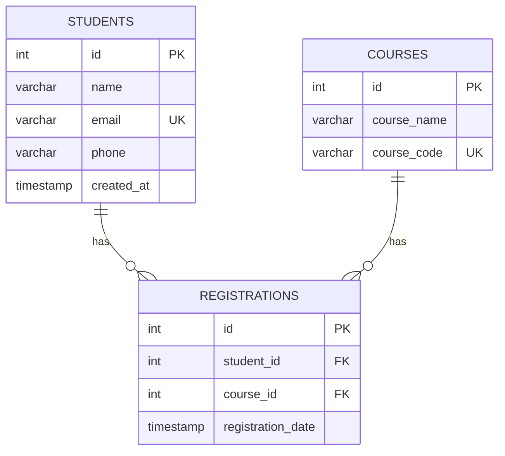

# Student Management System

A command-line **Java + MySQL** application that manages students, courses and course registrations using **JDBC**.
Built for Module 4 – Java Database & JDBC.

It demonstrates:

- Full CRUD operations on a relational database via JDBC
- **Prepared statements** for every query (no SQL built from user input, so no SQL injection)
- **Database transactions** with commit/rollback
- A layered design: CLI → Service → DAO → Database

---

## Features

| # | Menu option | What it does |
|---|-------------|--------------|
| 1 | Add Student | Validates name, email and phone, then inserts a student |
| 2 | View Students | Lists all students in a table |
| 3 | Search Student | Search by ID, or by part of a name/email (`LIKE`) |
| 4 | Update Student | Edit any field; press Enter to keep the current value |
| 5 | Delete Student | Deletes after confirmation; registrations are removed by `ON DELETE CASCADE` |
| 6 | Add Course | Adds a course with a unique course code |
| 7 | Register Student | Registers a student for **one or more courses in a single transaction** |
| 8 | View Registrations | Shows all registrations, or only one student's |
| 9 | Exit | |

Friendly error messages are shown for invalid input, duplicate emails/course codes, and database connection problems.

## Technologies

- Java 17
- MySQL 8
- JDBC (MySQL Connector/J 8.4)
- SQL
- Maven
- Git / GitHub

---

## Database design



- `students` and `courses` have a **many-to-many** relationship, resolved by the `registrations` table.
- Both foreign keys use `ON DELETE CASCADE`: deleting a student or course also deletes its registrations.
- A `UNIQUE (student_id, course_id)` constraint stops a student registering for the same course twice.

The full script is in [`sql/schema.sql`](sql/schema.sql). Optional test data is in [`sql/sample_data.sql`](sql/sample_data.sql).

## Project structure

```
student-management-system/
├── sql/
│   ├── schema.sql               # creates the database and tables
│   └── sample_data.sql          # optional sample rows
├── src/main/java/com/studentmanagement/
│   ├── Main.java                # CLI menu
│   ├── database/
│   │   └── DatabaseConnection.java
│   ├── model/                   # Student, Course, Registration
│   ├── dao/                     # StudentDAO, CourseDAO, RegistrationDAO (all SQL lives here)
│   └── service/
│       └── StudentService.java  # validation + transactions
├── src/main/resources/
│   └── db.properties.example    # template for your DB credentials
├── pom.xml
└── README.md
```

---

## Getting started

### 1. Install the prerequisites

- **JDK 17 or newer**: <https://adoptium.net>
- **Maven**: <https://maven.apache.org/download.cgi> (or use the Maven support built into IntelliJ / VS Code)
- **MySQL Server 8**: <https://dev.mysql.com/downloads/installer/>
  - On Windows, run the MySQL Installer and choose **Server only** (or **Developer Default** to also get MySQL Workbench).
  - Set a password for the `root` user when asked, and leave the port as `3306`.
  - On macOS: `brew install mysql && brew services start mysql`
  - On Ubuntu: `sudo apt install mysql-server`

Check everything is installed:

```bash
java -version
mvn -version
mysql --version
```

### 2. Create the database

```bash
mysql -u root -p < sql/schema.sql
mysql -u root -p < sql/sample_data.sql   # optional
```

Or open `sql/schema.sql` in MySQL Workbench and run it.

> ⚠️ `schema.sql` starts with `DROP DATABASE IF EXISTS student_management`, so running it again resets all data.

### 3. Configure the connection

Copy the example config and put in your MySQL password:

```bash
cp src/main/resources/db.properties.example src/main/resources/db.properties
```

```properties
db.url=jdbc:mysql://localhost:3306/student_management
db.user=root
db.password=your_password
```

`db.properties` is in `.gitignore`, so your password is never pushed to GitHub.
You can also set the environment variables `DB_URL`, `DB_USER` and `DB_PASSWORD` instead. They override the file.

### 4. Run the application

```bash
mvn compile exec:java
```

Or build a single runnable JAR (the MySQL driver is bundled into it):

```bash
mvn package
java -jar target/student-management-system-1.0.0.jar
```

---

## How JDBC is used

### Prepared statements

Every query passes user input as a parameter (`?`). It is never concatenated into the SQL string:

```java
String sql = """
        INSERT INTO students (name, email, phone)
        VALUES (?, ?, ?)
        """;

try (Connection connection = DatabaseConnection.getConnection();
     PreparedStatement statement = connection.prepareStatement(sql, Statement.RETURN_GENERATED_KEYS)) {

    statement.setString(1, student.getName());
    statement.setString(2, student.getEmail());
    statement.setString(3, student.getPhone());
    statement.executeUpdate();
    ...
}
```

`try-with-resources` makes sure connections and statements are always closed.

### Transactions

Registering a student for several courses (`StudentService.registerStudent`) runs as one transaction.
If any course is invalid or already taken, **nothing** is saved:

```java
try (Connection connection = DatabaseConnection.getConnection()) {
    connection.setAutoCommit(false);
    try {
        // check the student exists
        // for each course: check it exists, check not already registered, INSERT
        connection.commit();
    } catch (SQLException | RuntimeException e) {
        connection.rollback();   // undo every insert made in this transaction
        throw e;
    }
}
```

---

## Example CRUD operations

Output below comes from running the app against the sample data.

**Add a student (Create)**

```
--- Add Student ---
Name: Naledi Khumalo
Email: naledi@example.com
Phone (optional): 0741112222
Student added successfully with ID 4.
```

**View students (Read)**

```
--- All Students ---
ID   Name                      Email                            Phone
------------------------------------------------------------------------------
1    Thabo Mokoena             thabo.mokoena@example.com        0712345678
2    Lerato Ndlovu             lerato.ndlovu@example.com        0723456789
3    Sipho Dlamini             sipho.dlamini@example.com        0734567890
4    Naledi Khumalo            naledi@example.com               0741112222

4 student(s).
```

**Update a student**

```
--- Update Student ---
Student ID: 4
Press Enter to keep the current value.
Name [Naledi Khumalo]: Naledi K. Khumalo
Email [naledi@example.com]:
Phone [0741112222]:
Student updated successfully.
```

**Delete a student**

```
--- Delete Student ---
Student ID: 1
Delete Thabo Mokoena and all their registrations? (y/n): y
Student deleted successfully.
```

**Register for several courses in one transaction**

```
--- Register Student for Courses ---
Student ID: 4

ID   Code       Course
2    DBS201     Database Systems
1    PRG101     Introduction to Programming
3    SEN301     Software Engineering
4    WEB401     Web Development

Course ID(s), comma separated: 1, 4
Registered student 4 for 2 course(s).
```

**Transaction rollback**: Lerato (ID 2) is already registered for course 2. Asking for courses `3,2` fails on course 2,
so the course 3 insert is rolled back as well:

```
Course ID(s), comma separated: 3,2
Error: Student 2 is already registered for course 2.

--- View Registrations ---
Student ID (press Enter for all students): 2
ID   Student                   Code       Course                         Registered
------------------------------------------------------------------------------------------
3    Lerato Ndlovu             DBS201     Database Systems               2026-09-25 10:56

1 registration(s).
```

**Validation and constraint errors**

```
Email: notanemail
Error: 'notanemail' is not a valid email address.

Email: thabo.mokoena@example.com
Error: that record conflicts with existing data (for example, a duplicate email or course code).
```

---

## Screenshots

<!-- Replace these with your own screenshots saved in docs/screenshots/ -->

| Main menu | View students |
|-----------|---------------|
|  |  |

| Register student | Registrations |
|------------------|---------------|
|  |  |

---

## Author

**Akilimali**, [GitHub](https://github.com/yourusername)
